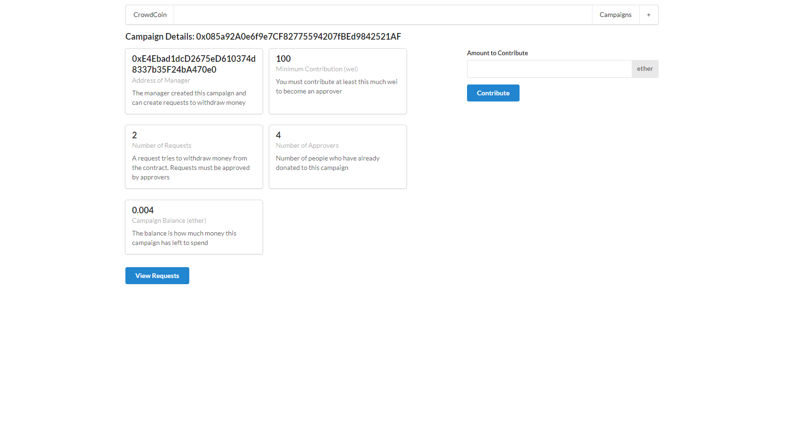

# Kickstart

A crowdfunding app using Next.js.

<!-- 

        

 -->

## Features

- using struct for request and creating struct instances.
- understanding the difference between storage and memory.
- using mappings rather than arrays for performance reasons.
- deploying a campaign factory to keep track of deployed campaigns.
- testing the factory with Remix.
- compiling the contracts with solc and fs-extra.
- testing the contracts with Mocha, Ganache CLI and web3.

Based on [Ethereum and Solidity: The Complete Developer's Guide](https://www.udemy.com/course/ethereum-and-solidity-the-complete-developers-guide/) by Stephen Grider (2021).
