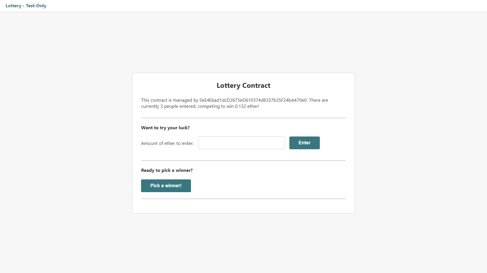

# Ethereum & Solidity Projects

This repo is made of 4 projects:

1. [**Inbox**](#inbox): A small project to understand how to test and deploy smart contracts with Solidity.
2. [**Lottery**](#lottery): An Ethereum lottery to build and test a more advanced smart contract.
3. [**Lottery React**](#lotteryreact): A React front-end created around the lottery contract.
4. [**Kickstart**](#kickstart): A crowdfunding app using Next.js.

##  1) Inbox

A small project to understand how to test and deploy smart contracts with Solidity.

[See 01-inbox folder](https://github.com/solygambas/ethereum-solidity/tree/main/01-inbox)

### Features

- setting up a project in VS Code with [Solidity syntax highlighting](https://marketplace.visualstudio.com/items?itemName=JuanBlanco.solidity).
- creating a compile script for Solidity with solc.
- testing the contract with Mocha.
- fetching fake accounts from Ganache CLI.
- deploying locally with web3.
- deploying to Rinkeby network with hdwallet-provider and Infura API.
- observing deployment on Etherscan and testing the new contract in Remix.

##  2) Lottery

An Ethereum lottery to build and test a more advanced smart contract.

[See 02-lottery folder](https://github.com/solygambas/ethereum-solidity/tree/main/02-lottery)

### Features

- understanding basic and reference types in Solidity: arrays, mappings and structs.
- entering the lottery and validating payment with a require statement.
- generating a pseudo random number and selecting a winner.
- sending money to the winner and resetting the lottery.
- restricting access with a function modifier.
- debugging with Remix.
- writing tests with Mocha and using try-catch assertions.
- deploying to Rinkeby network with hdwallet-provider and Infura API.

##  3) Lottery React

A React front-end created around the lottery contract.

[See Demo deployed on Vercel](https://ethereum-lottery.vercel.app/)
([MetaMask Plugin](https://metamask.io/) is required)

[See 03-lottery-react folder](https://github.com/solygambas/ethereum-solidity/tree/main/03-lottery-react)

    

### Features

- setting up a React project.
- creating a web3 instance and a local contract instance.
- detecting the MetaMask Ethereum provider with @metamask/detect-provider.
- enforcing the connection to the Rinkeby test network.
- rendering contract data.
- entering the lottery, checking user input and sending a transaction.
- adding user-friendly notifications.
- picking a winner.

##  4) Kickstart

A crowdfunding app using Next.js.

[See 04-kickstart folder](https://github.com/solygambas/ethereum-solidity/tree/main/04-kickstart)

    

### Features

- using struct for request and creating struct instances.
- understanding the difference between storage and memory.
- using mappings rather than arrays for performance reasons.
- deploying a campaign factory to keep track of deployed campaigns.
- testing the factory with Remix.
- compiling the contracts with solc and fs-extra.
- testing the contracts with Mocha, Ganache CLI and web3.
- deploying to Rinkeby network with hdwallet-provider and Infura API.
- creating a test campaign with Remix and Metamask.
- handling server and client Web3 instances.
- fetching deployed campaigns with getInitialProps.
- building an interface with Semantic UI React.
- handling forms to create a new campaign and to contribute.
- navigating between pages with Link and useRouter.
- displaying campaign details with Next dynamic routes.
- listing out all the requests and adding a new one.
- approving and finalizing requests.

Based on [Ethereum and Solidity: The Complete Developer's Guide](https://www.udemy.com/course/ethereum-and-solidity-the-complete-developers-guide/) by Stephen Grider (2021).
