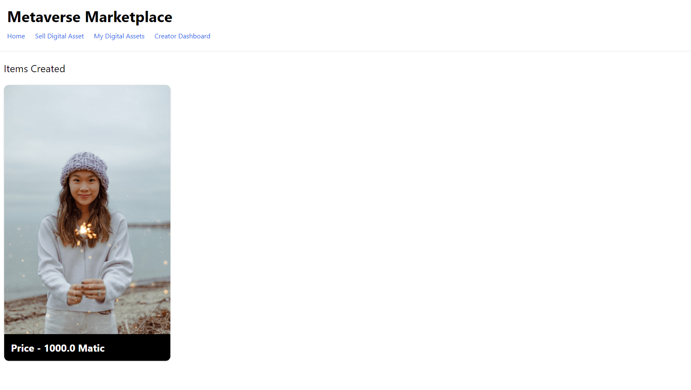

# NFT Marketplace

An NFT marketplace using Polygon and Next.js.

<!-- [See Demo deployed on Vercel](https://crowdcoin-ethereum.vercel.app/)
([MetaMask Plugin](https://metamask.io/) is required) -->

<!-- 

        

 -->

## Features

- setting up a Next.js project with Tailwind CSS.
- creating a Ethereum development environment with Hardat.

Based on [How to Build a Full Stack NFT Marketplace on Ethereum with Polygon and Next.js](https://www.youtube.com/watch?v=GKJBEEXUha0) by Nader Dabit (2021).
